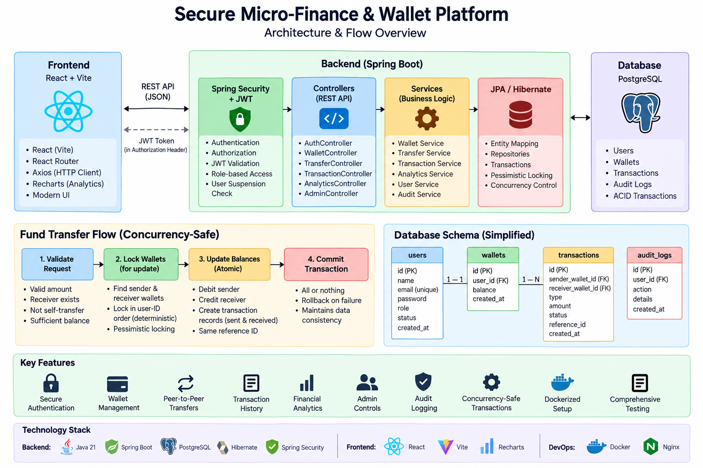

# Secure Micro-Finance & Wallet Platform

A full-stack financial wallet application built with **Spring Boot, React, and PostgreSQL**.

The platform supports secure user authentication, wallet management, peer-to-peer transfers, transaction history, financial analytics, administrative controls, and audit logging.

## Architecture

React + Vite
     |
     | REST API / JSON
     v
Spring Boot
     |
     | JPA / Hibernate
     v
PostgreSQL

The application is implemented as a **modular monolith** and containerized using **Docker Compose**.

### Architecture Diagram

---

## Key Features

### Authentication & Authorization

- User registration and login
- BCrypt password hashing
- JWT-based authentication
- Stateless Spring Security configuration
- Role-based access control
- `ROLE_USER` and `ROLE_ADMIN`
- Suspended users cannot authenticate or access protected APIs

### Wallet Management

- View wallet balance
- Deposit funds
- Withdraw funds
- Server-side amount validation
- `BigDecimal` for financial calculations
- Transaction records created for wallet operations

### Peer-to-Peer Transfers

- Transfer funds using the receiver's email
- Sender and receiver validation
- Prevents self-transfers
- Insufficient-balance protection
- Atomic balance updates
- Sent and received ledger entries share a reference ID
- Database transaction boundaries ensure rollback on failure
- Pessimistic wallet locking protects concurrent balance updates
- Deterministic wallet lock ordering reduces deadlock risk

### Transaction History

- Paginated transaction history
- Sorting support
- Filter by transaction type
- Filter by transaction status
- Immutable transaction records

### Financial Analytics

- Current wallet balance
- Total inflow
- Total outflow
- Sent and received transfer totals
- Transaction counts
- Daily inflow/outflow trends

### Administration

- Admin-only user management
- View registered users
- Activate users
- Suspend users
- Protection against administrators suspending themselves
- Administrative audit logging

### Audit Logging

Important activities are recorded in an audit log, including:

- User registration
- Deposits
- Withdrawals
- Transfers
- User activation
- User suspension

---

## Technology Stack

### Backend

- Java 21
- Spring Boot
- Spring Web
- Spring Security
- Spring Data JPA
- Hibernate
- PostgreSQL
- Maven
- JJWT
- JUnit 5
- Mockito
- MockMvc
- JaCoCo

### Frontend

- React
- Vite
- JavaScript
- React Router
- Axios
- Recharts
- ESLint

### DevOps

- Docker
- Docker Compose
- Nginx
- PostgreSQL Docker image

---

## Security

The application follows several security practices:

- Passwords are never stored as plaintext
- BCrypt is used for password hashing
- JWT tokens are used for stateless authentication
- Protected endpoints require authentication
- Administrative endpoints require `ROLE_ADMIN`
- Suspended users are rejected by authentication
- Financial amounts are calculated server-side
- `BigDecimal` is used for monetary values
- Database transactions protect multi-step financial operations
- Environment variables are used for database credentials and JWT secrets
- Secrets are intentionally excluded from version control

---

## Concurrency & Transaction Safety

Financial transfers are treated as transactional operations.

A transfer:

1. Validates the amount.
2. Identifies the receiver.
3. Locks both wallets for update.
4. Acquires wallet locks in deterministic user-ID order.
5. Validates the sender's balance.
6. Updates both balances.
7. Creates the corresponding ledger entries.
8. Commits the entire operation atomically.

If an operation fails, the transaction is rolled back.

The project includes integration and concurrency tests that exercise simultaneous transfers against the same wallet.

---

## Testing

The backend test suite includes:

- Unit tests
- Service-layer tests
- Controller tests
- Security tests
- JWT tests
- Validation tests
- Integration tests
- Registration integration tests
- Transfer integration tests
- Transfer concurrency tests
- Wallet concurrency tests
- Authentication integration tests

### Latest Verified Backend Result

Tests run: 106
Failures: 0
Errors: 0
Skipped: 0

BUILD SUCCESS

The frontend was also verified with:

bash
npm run lint
npm run build

Both completed successfully.

---

## Project Structure

secure-micro-finance-wallet/
│
├── src/
│   ├── main/
│   │   ├── java/com/finance/wallet/
│   │   │   ├── config/
│   │   │   ├── controller/
│   │   │   ├── dto/
│   │   │   ├── entity/
│   │   │   ├── exception/
│   │   │   ├── repository/
│   │   │   ├── security/
│   │   │   └── service/
│   │   └── resources/
│   │
│   └── test/
│       ├── java/com/finance/wallet/
│       └── resources/
│
├── frontend/
│   ├── src/
│   │   ├── components/
│   │   ├── context/
│   │   ├── layouts/
│   │   ├── pages/
│   │   └── services/
│   ├── Dockerfile
│   ├── nginx.conf
│   └── package.json
│
├── Dockerfile
├── docker-compose.yml
├── pom.xml
└── README.md

---

## Running with Docker

Create a `.env` file in the project root:

env
DB_PASSWORD=your_database_password
JWT_SECRET=your_long_random_jwt_secret

**Do not commit this file.**

Build and start the complete application:

bash
docker compose up --build

The application will be available at:

- Frontend: `http://localhost:5173`
- Backend API: `http://localhost:8080`

### Stop the Application

bash
docker compose down

### Stop and Remove PostgreSQL Data

bash
docker compose down -v

> `docker compose down -v` deletes the Dockerized PostgreSQL data volume.

---

## Running Without Docker

### Backend

Configure PostgreSQL and provide the required environment variables.

#### Windows PowerShell

powershell
$env:DB_PASSWORD="your_database_password"
$env:JWT_SECRET="your_long_random_jwt_secret"

Then run:

powershell
.\mvnw spring-boot:run

### Frontend

bash
cd frontend
npm install
npm run dev

The Vite development server runs on:

http://localhost:5173

---

## API Overview

### Authentication

| Method | Endpoint | Description |
|---|---|---|
| `POST` | `/api/auth/register` | Register a new user |
| `POST` | `/api/auth/login` | Authenticate and obtain a JWT |

### Wallet

| Method | Endpoint | Description |
|---|---|---|
| `GET` | `/api/wallet` | Get wallet details |
| `POST` | `/api/wallet/deposit` | Deposit funds |
| `POST` | `/api/wallet/withdraw` | Withdraw funds |

### Transfers

| Method | Endpoint | Description |
|---|---|---|
| `POST` | `/api/transfers` | Transfer funds to another user |

### Transactions

| Method | Endpoint | Description |
|---|---|---|
| `GET` | `/api/transactions` | Get paginated transaction history |

Supports pagination, sorting, transaction type filtering, and transaction status filtering.

### Analytics

| Method | Endpoint | Description |
|---|---|---|
| `GET` | `/api/analytics` | Get financial analytics |
| `GET` | `/api/analytics/trends` | Get daily inflow/outflow trends |

### Administration

| Method | Endpoint | Description |
|---|---|---|
| `GET` | `/api/admin/users` | View registered users |
| `PUT` | `/api/admin/users/{userId}/status` | Activate or suspend a user |
| `GET` | `/api/admin/audit-logs` | View administrative audit logs |

Administrative endpoints require `ROLE_ADMIN`.

---

## Future Improvements

Potential future versions could introduce:

- Microservice decomposition
- Redis caching
- Kafka/event-driven processing
- Kubernetes deployment
- External payment integration
- Notification services
- More advanced observability
- Cloud deployment
- CI/CD automation

These features are intentionally outside the current **V1 implementation**.

---

## Project Goals

This project was designed to demonstrate practical backend and full-stack engineering skills, including:

- Object-oriented Java development
- REST API design
- Database modeling
- Transaction management
- Concurrency control
- Authentication and authorization
- Automated testing
- React application development
- Containerization
- Production-oriented application structure

---

## License

This project is intended as a **portfolio and learning project**.
